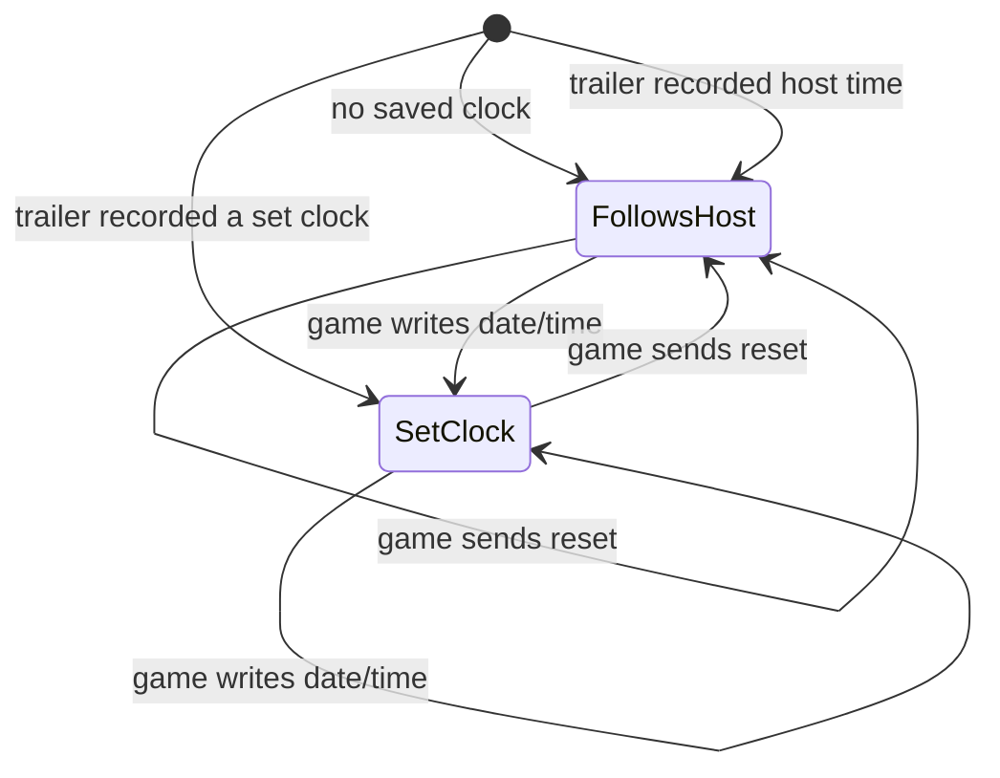

# GBA cartridge clock (RTC)

Pokémon Ruby/Sapphire/Emerald, Boktai 1–3, Rockman EXE 4.5, Sennen Kazoku and a few
others carry a Seiko S-3511A real-time clock on the cartridge GPIO port. This page
records how dingbat's clock behaves and why. Code: `src/dingbat/gba/rtc.nim` (chip),
`rtc_calendar.nim` (calendar rules, battery-save trailer); tests:
`tests/gba_rtc_test.nim`, `tools/playtest/rtc_crosscheck.py` (against mGBA).

## Decision

**The clock shows the host's time unless a game has set it.**

1. A cart with no saved clock reads the host's local date and time.
2. A game that writes the date or time (a clock-setting screen) gets exactly that clock.
   It keeps running in real seconds and is saved with the game.
3. The chip's reset command puts the clock back on host time. The real chip loads
   2000-01-01 00:00:00 here. That is the one deliberate departure from the hardware.
4. The clock is saved as the 16-byte RTC trailer that FlashGBX and mGBA use, appended
   to the battery save.

## Why

- **Not confusing.** Games that reset the clock without asking the player (Emerald on
  New Game) would otherwise carry a year-2000 clock in their save. A player moving that
  save to mGBA would then see year 2000 there. Host time is what players expect and what
  dingbat showed before.
- **Works with mGBA.** mGBA's clock is always the host clock (or a trailer's offset
  from it), and mGBA ignores reset and clock writes. For every game that does not set
  its own clock, dingbat and mGBA now write byte-identical trailers, so saves move both
  ways with no jump.
- **Keeps what the player set.** Keeping game-set clocks is where dingbat deliberately
  goes further than mGBA, which discards clock writes. That discarding is the bug behind
  mGBA issue #240, Rockman EXE 4.5 losing its time. The trailer carries the set clock,
  and mGBA honours it when it loads the save.
- **The departure is invisible.** Games reset the chip when it reports a power
  failure or when starting a new save; they then either prompt for a time (which is
  kept) or measure time from their own saved offset (Emerald's wall clock). Neither
  reads the reset date back.

*FollowsHost*: host local time, tracking time zone and daylight-saving changes.
*SetClock*: the set time plus real seconds elapsed since, independent of the host zone.

## How it behaves

| situation | dingbat | mGBA 0.10 | a real cart |
|---|---|---|---|
| New cart, no save | host date/time | host date/time | whatever the chip holds |
| Emerald: New Game (the game resets the chip) | stays on host time | stays on host time | 2000-01-01, counting up; Emerald shows its own wall-clock time, so the player sees no difference |
| A game's clock-setting screen (e.g. Rockman EXE 4.5): player sets the clock | kept, runs in real time, saved | discarded; host time wins | kept |
| Save made in dingbat, loaded in mGBA | mGBA shows the same clock (host time, or the set clock) | — | — |
| Save made in mGBA, loaded in dingbat | on the same machine, follows host time as in mGBA; from another time zone, resumes the clock the trailer recorded | — | — |
| Save with no trailer (older dingbat, VBA-M, a dump made without RTC data) | host time; the next save adds a trailer | same | — |
| Real-cart dump with RTC data (FlashGBX) | resumes the cart's clock plus the time since the dump | same, but misreads the hour in PM saves (below) | — |
| Daylight-saving change | follows the host while on host time; a set clock keeps counting real seconds | follows the host | chip keeps counting |
| Rollback netplay / replays (deterministic mode) | frozen shared epoch; a saved offset comes from bytes both peers load, so peers agree | — | — |
| Trailer on a cart without an RTC | ignored for timekeeping, kept byte-for-byte when the save is rewritten; none is ever added | — | — |
| Tools that accept only exact chip sizes (VBA-M) | will not load a save with a trailer; mGBA's Save Converter can strip it | same | — |

## The trailer

After the chip bytes (any save type), when the file length mod 512 is 16:

| bytes | contents |
|---|---|
| 0–6 | year (00–99 = 2000–2099), month, day, weekday, hour, minute, second, BCD |
| 7 | status register (24-hour flag, interrupt bits). Older FlashGBX writes 0x01 here; read as 24-hour |
| 8–15 | Unix time (u64, little-endian) at which the date/time was read |

- **Reading:** the clock resumes as *saved date/time + (now − bytes 8–15)*. This is the
  same wherever the file moves, whatever the time zone. A trailer whose date/time equals
  the host's local time at that Unix time recorded a host clock, and keeps following the
  host. Out-of-range fields or a Unix time of 0 make the trailer ignored, never read as
  save data.
- **Writing:** the hour byte is written as a plain 24-hour value. FlashGBX sets the PM
  bit (bit 7) on afternoon hours; mGBA 0.10.5 then reads 0x97 as hour 97. The plain form
  reads correctly in both.
- **Precision:** whole seconds.
- **Range and rollover:** the chip's calendar runs 2000-01-01 to 2099-12-31 and rolls
  back to 2000, with every fourth year a leap year (correct throughout that range). It
  is the chip's own limit and applies to every emulator and cart. Choosing a later base
  date would not delay it. Games that count elapsed days would see time jump backwards at
  the rollover.

## Sources

S-3511A datasheet Rev. 1.4 (commands, status bits, reset values, validation of written
data); GBATEK "GBA Cart Real-Time Clock"; FlashGBX (the trailer format: its
battery-save restore and RTC read/write code, v3.19 changelog) and the format proposal
in mGBA issue #2431. mGBA 0.10.5 is a cross-check only (`rtc_crosscheck.py`).
